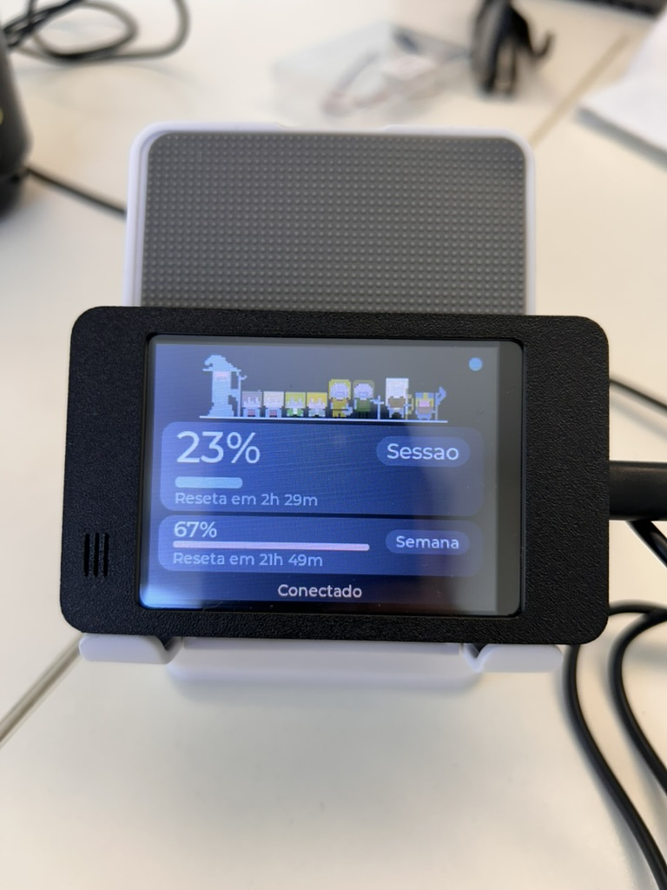
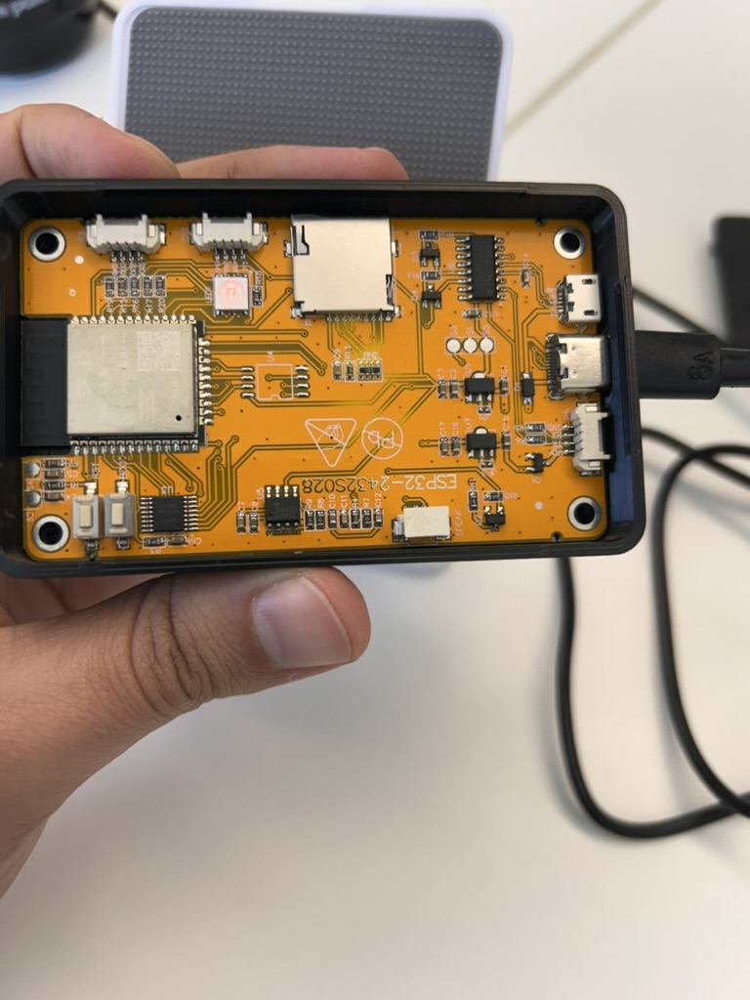

# Token Meter (ESP32 CYD)

A physical meter for your **Claude Code** token usage, running on a 2.8" ESP32
board (the "CYD"). A daemon on your Mac reads your account's real usage and
pushes it over Bluetooth to the device, which shows your usage-window percentage
in near real time.

**Inspired by** [Clawdmeter](https://github.com/HermannBjorgvin/Clawdmeter) by
Hermann Björgvin. It reuses the core idea (reading usage from the API's
rate-limit headers and transmitting it over BLE), but it's original code written
for a different board and it does **not** redistribute any proprietary assets
(Anthropic fonts or the Clawd mascot). MIT licensed. See [Credits](#credits).

<p align="center">
  
</p>

<p align="center"><em>Live view: session and weekly usage, reset countdowns, and a
<code>Connected</code> footer while the daemon is in range.</em></p>

> **Have the same board?** Follow the **[step-by-step setup guide](docs/SETUP.md)**
> to run this project and reach the same working state (flash the firmware, run
> the daemon, calibrate touch).

---

## How it works

```
┌─────────────── Mac ───────────────┐        ┌──────── ESP32 CYD ────────┐
│ Python daemon                      │        │ firmware (PlatformIO)     │
│  1. reads the OAuth token          │  BLE   │  - GATT server (NimBLE)   │
│  2. makes a minimal API call       │ ─────▶ │  - parses the JSON        │
│  3. extracts usage from the        │  GATT  │  - LVGL: % cards          │
│     response rate-limit headers    │        │  - XPT2046 touch          │
│  4. pushes a JSON over BLE         │        │                           │
└────────────────────────────────────┘        └───────────────────────────┘
```

1. The daemon reads the Claude OAuth token from the **macOS Keychain**.
2. It makes a minimal call to `api.anthropic.com/v1/messages`.
3. Usage comes straight from the response headers
   (`anthropic-ratelimit-unified-5h-utilization` and friends) — it doesn't burn
   real tokens to measure.
4. It sends `{ session_pct, weekly_pct }` over a BLE GATT characteristic.
5. The ESP32 receives it and updates the screen.

The ESP32 **never** talks to the API and never holds your token — all secrets
stay on the Mac.

---

## Hardware

**ESP32-2432S028** board ("Cheap Yellow Display" / CYD):

<p align="center">
  
</p>

<p align="center"><em>The board itself — the <code>ESP32-2432S028</code> silkscreen (and
the classic orange PCB) is how you confirm you have the right one.</em></p>

| Component | Detail |
|---|---|
| SoC | ESP32-WROOM-32 (dual-core 240 MHz, 520 KB RAM, no PSRAM) |
| Flash | 4 MB |
| Display | 2.8" 320×240 SPI — ILI9341 or ST7789 |
| Touch | XPT2046 resistive (its own SPI bus) |
| USB | CH340C → shows up as `/dev/cu.usbserial-*` on the Mac |
| Radio | Wi-Fi + Bluetooth (BLE 4.2) |

### Pinout used

```
Display (SPI):   SCK=IO14  MOSI=IO13  MISO=IO12  CS=IO15  DC=IO2  BL=IO21
Touch (XPT2046): CLK=IO25  MOSI=IO32  MISO=IO39  CS=IO33  IRQ=IO36
```

> **Display and touch are on separate SPI buses.** The touch controller uses its
> own SPI instance — a CYD detail that trips up many beginners.

### Where to buy

The CYD is a common, cheap dev board — search for **`ESP32-2432S028`** on any
marketplace (roughly US$8–15). Make sure it's the **2.8"** variant with the
resistive touch panel (this is the one this firmware is pinned for).

- **Brazil (the exact unit used here):**
  [Módulo ESP32 com Tela de Toque TFT LCD 2.8" — Mercado Livre](https://www.mercadolivre.com.br/modulo-desenvolvimento-esp32-com-tela-de-toque-tft-lcd-28/p/MLB64969790)
- **International:** AliExpress / Amazon — search `ESP32-2432S028` or
  `Cheap Yellow Display 2.8`.

> There are CYD variants with different display drivers (ILI9341 vs ST7789). If
> colors or the panel look wrong after flashing, see the driver switch in
> [Bring-up](#2-bring-up-do-this-first).

---

## Requirements

- **VSCode** with the **PlatformIO IDE** extension (auto-recommended when you
  open the repo).
- **Python 3.11+** for the daemon.
- A Mac (the daemon reads the macOS Keychain). Linux/Windows would need the
  credential reading adapted — the daemon already supports the Linux file path
  (`~/.claude/.credentials.json`).

---

## Getting started

### 1. Firmware

Open the repo folder in VSCode; it suggests the PlatformIO extension — install
it. Then, from the PlatformIO bottom bar:

- **Select the environment** `bringup` (hardware test) or `app` (full firmware).
- **Build** (check icon) compiles.
- **Upload** (→ arrow) flashes the board. The `/dev/cu.usbserial-*` port is
  auto-detected.
- **Serial Monitor** (plug icon) shows logs at 115200 baud.

You can also use the terminal:

```bash
cd firmware
pio run -e bringup            # compile
pio run -e bringup -t upload  # flash
pio device monitor            # logs
```

### 2. Bring-up (do this first)

The `bringup` environment is an isolated hardware test. After flashing you
should see:

- Color bars + the text "CYD bring-up OK" on the display.
- Touching the screen shows a yellow dot and prints raw touch coordinates on the
  Serial Monitor.

**If the screen is white or blank:** the driver is wrong. Open
`firmware/src/bringup/main.cpp` and switch `DISPLAY_DRIVER` from `0` (ILI9341) to
`1` (ST7789). Inverted colors: adjust the `ips` parameter.

### 3. Daemon (Mac)

Reads your Claude usage and transmits it to the board over BLE.

```bash
cd daemon
python3 -m venv venv && source venv/bin/activate
pip install -r requirements.txt
python daemon.py
```

Prerequisites:
- Be logged into **Claude Code** (the daemon reads the OAuth token from the
  Keychain, service `Claude Code-credentials`).
- Grant **Bluetooth** permission to the terminal/Python on first run (macOS asks
  under Settings > Privacy & Security > Bluetooth).

The daemon looks for the `TokenMeter` device, connects, and sends
`{"session":NN,"weekly":NN}` every 30s. The token never leaves the machine and
is never logged.

See [daemon/README.md](daemon/README.md) to run it in the background
(autostart via launchd on macOS, systemd on Linux).

---

## Powering it and taking it elsewhere

The board is powered over **micro-USB**. It has no battery — it must be plugged
into a USB power source (5V).

**At home, near the Mac:**
1. Plug the board into any USB wall charger (or the Mac itself).
2. Keep the daemon running on the Mac (it starts on login via launchd).
3. While **within Bluetooth range** (~10 m, same room), the board shows live
   usage: "Connected" footer and cards updating every ~30s.

**Packed up and taken to the office / elsewhere:**
- The board **powers on and shows the UI**, but stays on **"Waiting…"** (no
  fresh numbers) because there's no data source nearby.
- To show data away from home you need **a data source within BLE range**:
  - bring the **Mac** along (with the daemon running), or
  - leave an **always-on host** at the location (Raspberry Pi/mini-PC running the
    daemon — see `daemon/README.md`).
- Bluetooth is **point-to-point and short-range**: the board only receives from
  the host that's nearby. It does not work "over the internet" on its own.

> In short: near the Mac (or the host), just plug it into power. Away from any
> host, it shows the UI but without updated usage.

## Top image

The top shows a static image. By default the repo ships original art
(`firmware/src/app/party_img.c`). You can swap in **any image of your own**:

```bash
python tools/img_to_c.py path/to/your-image.png   # PNG/WEBP/JPG/GIF
```

This generates `party_img_user.c/.h` (gitignored). Just **re-flash** — `ui.cpp`
detects the local file (via `__has_include`) and uses it instead of the default
art.

Board limits (no PSRAM): the converter **resizes** the image to fit ~300×62; a
static image doesn't flicker (unlike an animated GIF, which was dropped because
it can't run smoothly on this board).

> The generated file is **gitignored** and never enters the repository — each
> person uses their own image locally. In a public repo, do not include
> third-party art/characters.

## Repository layout

```
esp32/
├── firmware/            # PlatformIO project
│   ├── platformio.ini   # bringup and app environments
│   └── src/
│       ├── bringup/     # isolated display + touch test (step 1)
│       └── app/         # full firmware (LVGL + BLE)
├── daemon/              # Mac/Linux Python daemon (+ launchd/systemd units)
├── tools/               # img_to_c.py (custom top image)
├── docs/
│   ├── media/           # product photos used in this README
│   └── specs/           # design document
└── README.md
```

---

## Roadmap

- [x] Identify the board and map the pinout
- [x] Bring-up: display + touch test
- [x] LVGL UI with sample data
- [x] XPT2046 touch calibration (persisted in NVS)
- [x] BLE GATT server on the ESP32
- [x] Mac daemon (Keychain + API + BLE)
- [x] Daemon autostart (launchd on macOS / systemd on Linux)
- [x] Visual polish (level-based color, custom image, reset countdown)
- [x] Always-on host (Raspberry Pi/Linux) for Mac independence
- [ ] (blocked) Dedicated OAuth login on the board itself — Anthropic's
  attestation/captcha prevents a headless flow

---

## Contributing

Contributions are welcome — bug reports, docs fixes, features, or just telling me
you got it running. See [CONTRIBUTING.md](CONTRIBUTING.md) for setup and
guidelines.

## Credits

- Inspired by [Clawdmeter](https://github.com/HermannBjorgvin/Clawdmeter) by
  Hermann Björgvin — origin of the architecture (a daemon reads usage from the
  rate-limit headers and transmits it over BLE).
- This project does **not** use Anthropic's proprietary fonts or the Clawd
  mascot; it uses free fonts and its own visuals.

## License

[MIT](LICENSE) — original code only.
